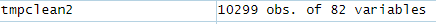

---
title: "Codebook Human Activity Recognition Using Smartphones Dataset"
author: "Harriet Neijnens"
date: "19.07.2019"
output: html_document
keep_md: yes
---

## Project Description
Smartlab conducted experiments to collect and analyse data about human acitivity like walking or sitting by using smartphones.
The goal of the project was to optimize wearable computing.

## Study design and data processing
The experiments have been carried out with a group of 30 volunteers within an age bracket of 19-48 years. Each person performed six activities (WALKING, WALKING_UPSTAIRS, WALKING_DOWNSTAIRS, SITTING, STANDING, LAYING) wearing a smartphone (Samsung Galaxy S II) on the waist. Using its embedded accelerometer and gyroscope, Smartlab captured 3-axial linear acceleration and 3-axial angular velocity at a constant rate of 50Hz. The experiments have been video-recorded to label the data manually. The obtained dataset has been randomly partitioned into two sets, where 70% of the volunteers was selected for generating the training data and 30% the test data. 

The sensor signals (accelerometer and gyroscope) were pre-processed by applying noise filters and then sampled in fixed-width sliding windows of 2.56 sec and 50% overlap (128 readings/window). The sensor acceleration signal, which has gravitational and body motion components, was separated using a Butterworth low-pass filter into body acceleration and gravity. The gravitational force is assumed to have only low frequency components, therefore a filter with 0.3 Hz cutoff frequency was used. From each window, a vector of features was obtained by calculating variables from the time and frequency domain.  

The features selected for this data come from the accelerometer and gyroscope 3-axial raw signals tAcc-XYZ and tGyro-XYZ. These time domain signals (prefix 't' to denote time) were captured at a constant rate of 50 Hz. Then they were filtered using a median filter and a 3rd order low pass Butterworth filter with a corner frequency of 20 Hz to remove noise. Similarly, the acceleration signal was then separated into body and gravity acceleration signals (tBodyAcc-XYZ and tGravityAcc-XYZ) using another low pass Butterworth filter with a corner frequency of 0.3 Hz. 

Subsequently, the body linear acceleration and angular velocity were derived in time to obtain Jerk signals (tBodyAccJerk-XYZ and tBodyGyroJerk-XYZ). Also the magnitude of these three-dimensional signals were calculated using the Euclidean norm (tBodyAccMag, tGravityAccMag, tBodyAccJerkMag, tBodyGyroMag, tBodyGyroJerkMag).Finally a Fast Fourier Transform (FFT) was applied to some of these signals producing fBodyAcc-XYZ, fBodyAccJerk-XYZ, fBodyGyro-XYZ, fBodyAccJerkMag, fBodyGyroMag, fBodyGyroJerkMag. (Note the 'f' to indicate frequency domain signals).These signals were used to estimate variables of the feature vector for each pattern: '-XYZ' is used to denote 3-axial signals in the X, Y and Z directions.

## Creating the tidy data set

### 0 Get data
Download and unpack zip file, load raw data in R
```{r}
> Xtest <- read.table("X_test.txt", header = FALSE)
> Ytest <- read.table("Y_test.txt", header = FALSE)
> subjectstest <- read.table ("subject_test.txt", header = FALSE)
> Xtrain <- read.table("X_train.txt", header = FALSE)
> Ytrain <- read.table("Y_train.txt", header = FALSE)
> subjectstrain <- read.table ("subject_train.txt", header = FALSE)
> features <- read.table("features.txt", header = FALSE)
> activities <- read.table("activity_labels.txt", header = FALSE)
```


View raw data


Change 561 dummy column names of measurements (Xtest, Xtrain) to features
for example „V1“ will be renamed to „tBodyAcc-mean()-X“

```{r}
> names(Xtest) <- features$V2
> names(Xtrain) <- features$V2
```

Change dummy column names „V1“ to activityCode and subjectCode respectively:

```{r}
> names(Ytest) <- "activityCode"
> names(Ytrain) <- "activityCode"

> names(subjectstest) <- "subjectCode"
> names(subjectstrain) <- "subjectCode"

> names(activities) <- c("activityCode","activityName")
```


### 1 Make one dataset

Construction of one dataset


Horizontal: To be on the safe side I add a rownumber per segment and the segment the data came from:

```{r}
> tmptest <- cbind(subjectstest, Ytest, Xtest)
> tmptest$segmentID <- seq.int(nrow(tmptest))
> tmptest$segment <- "test"

> tmptrain <- cbind(subjectstrain, Ytrain, Xtrain)
> tmptrain$segmentID <- seq.int(nrow(tmptrain))
> tmptrain$segment <- "train"
```

Vertical: combination of test & training segment

```{r}
> tmp <- rbind(tmptrain, tmptest)
> tmp$ID <- seq.int(nrow(tmp))
```


View temporary datasets


*) activity names are merged later, see step 3


### 2 Extract relevant measures (mean, sd)

```{r}
> library(dplyr)
```

```{r}
> table(grepl("mean",names(tmp)))

FALSE  TRUE 
  520    46 
```

```{r}
> table(grepl("std",names(tmp)))

FALSE  TRUE 
  533    33 
```


Assessment: 79 columns of variables + subjectCode + activityCode +  ID = 82 columns

But there seem to be columns with duplicate column names which create problems when dplyr is applied. None of those duplicate columns have mean or standard deviation in there name so those columns will be deleted 

```{r}
> names_freq <- as.data.frame(table(names(tmp)))
> dupnames <- names_freq[names_freq$Freq > 1, ]$Var1
> nodupnames <- names(tmp)[!names(tmp) %in% dupnames]
> tmpclean <- subset(tmp, select = nodupnames)
```

Result: cleantmp 566 reduced to 440 columns, all unique column names


```{r}
> table(grepl("mean",names(tmpclean)))

FALSE  TRUE 
  394    46 
```


```{r}
> table(grepl("std",names(tmpclean)))

FALSE  TRUE 
  407    33 
```

Re-assessment: still 79 columns of relevant variables – confirmation that no relevant columns were deleted
result should have 82 columns (including subjectCode and activityCode and ID). Ready to extract relevant columns:

```{r}
> tmpclean2 <- select(tmpclean, subjectCode,activityCode, grep("mean",names(tmpclean), value = TRUE), grep("std",names(tmpclean), value = TRUE), ID)
```




### 3 Use descriptive activity names

add activityName to tmpclean2

```{r}
> tmpclean2 <- merge(tmpclean2, activities, by.x = "activityCode", by.y = "activityCode", all = TRUE)
```


### 4 Use descriptive variable names

get rid of the () for better readability

```{r}
> names(tmpclean2) <- sub("()","",names(tmpclean2),fixed = TRUE)
```

substitue time for t and frequ for f

```{r}
> names(tmpclean2) <- sub("tBody","timeBody",names(tmpclean2),fixed = TRUE)
> names(tmpclean2) <- sub("tGravity","timeGravity",names(tmpclean2),fixed = TRUE)
> names(tmpclean2) <- sub("fBody","frequBody",names(tmpclean2),fixed = TRUE)
```


### 5 Create tidy dataset

```{r}
> tmpclean3 <- select(tmpclean2, subjectCode, activityName, 3:81)
> bysubjectactivity <- group_by(tmpclean3, subjectCode, activityName)
> tidydataset <- summarise_each(bysubjectactivity, mean, "timeBodyAcc-mean-X":"frequBodyBodyGyroJerkMag-std")
> write.csv(tidydataset, file="tidydataset.csv")
```


## Description of the tidy data set

The tidy data set consists of 180 observations of 81 variables containing the average of each variable for each activity and each subject

Variables:

* subjectCode: identifies the subject; int; 1 - 30
* activityName: identifies the activity; Factor w/ 6 evels (WALKING, WALKING_UPSTAIRS, WALKING_DOWNSTAIRS, SITTING, STANDING, LAYING)
* timeBodyAcc-mean-X
* timeBodyAcc-mean-Y
* timeBodyAcc-mean-Z
* timeGravityAcc-mean-X
* timeGravityAcc-mean-Y
* timeGravityAcc-mean-Z
* timeBodyAccJerk-mean-X
* timeBodyAccJerk-mean-Y
* timeBodyAccJerk-mean-Z
* timeBodyGyro-mean-X
* timeBodyGyro-mean-Y
* timeBodyGyro-mean-Z
* timeBodyGyroJerk-mean-X
* timeBodyGyroJerk-mean-Y
* timeBodyGyroJerk-mean-Z
* timeBodyAccMag-mean
* timeGravityAccMag-mean
* timeBodyAccJerkMag-mean
* timeBodyGyroMag-mean
* timeBodyGyroJerkMag-mean
* frequBodyAcc-mean-X
* frequBodyAcc-mean-Y
* frequBodyAcc-mean-Z
* frequBodyAcc-meanFreq-X
* frequBodyAcc-meanFreq-Y
* frequBodyAcc-meanFreq-Z
* frequBodyAccJerk-mean-X
* frequBodyAccJerk-mean-Y
* frequBodyAccJerk-mean-Z
* frequBodyAccJerk-meanFreq-X
* frequBodyAccJerk-meanFreq-Y
* frequBodyAccJerk-meanFreq-Z
* frequBodyGyro-mean-X
* frequBodyGyro-mean-Y
* frequBodyGyro-mean-Z
* frequBodyGyro-meanFreq-X
* frequBodyGyro-meanFreq-Y
* frequBodyGyro-meanFreq-Z
* frequBodyAccMag-mean
* frequBodyAccMag-meanFreq
* frequBodyBodyAccJerkMag-mean
* frequBodyBodyAccJerkMag-meanFreq
* frequBodyBodyGyroMag-mean
* frequBodyBodyGyroMag-meanFreq
* frequBodyBodyGyroJerkMag-mean
* frequBodyBodyGyroJerkMag-meanFreq
* timeBodyAcc-std-X
* timeBodyAcc-std-Y
* timeBodyAcc-std-Z
* timeGravityAcc-std-X
* timeGravityAcc-std-Y
* timeGravityAcc-std-Z
* timeBodyAccJerk-std-X
* timeBodyAccJerk-std-Y
* timeBodyAccJerk-std-Z
* timeBodyGyro-std-X
* timeBodyGyro-std-Y
* timeBodyGyro-std-Z
* timeBodyGyroJerk-std-X
* timeBodyGyroJerk-std-Y
* timeBodyGyroJerk-std-Z
* timeBodyAccMag-std
* timeGravityAccMag-std
* timeBodyAccJerkMag-std
* timeBodyGyroMag-std
* timeBodyGyroJerkMag-std
* frequBodyAcc-std-X
* frequBodyAcc-std-Y
* frequBodyAcc-std-Z
* frequBodyAccJerk-std-X
* frequBodyAccJerk-std-Y
* frequBodyAccJerk-std-Z
* frequBodyGyro-std-X
* frequBodyGyro-std-Y
* frequBodyGyro-std-Z
* frequBodyAccMag-std
* frequBodyBodyAccJerkMag-std
* frequBodyBodyGyroMag-std
* frequBodyBodyGyroJerkMag-std


Domain variables are all num. The labels of the domain variabels are constructed of the following parts:
1. time/frequ: measurement of time or frequency
2. Body/Gravity: measurement of body or gravitational component
3. Acc/Gyro: measurement by accelerometer or gyroscope
4. mean/meanFreq/std: mean, mean frequency or standard deviation
5. X/Y/Z: 3-axial signals in the X, Y or Z directions


## Sources
* X_test.txt
* Y_test.txt
* subject_test.txt
* X_train.txt
* Y_train.txt
* subject_train.txt
* features.txt
* activity_labels.txt


